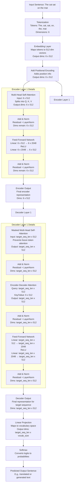

# langchain

```mermaid
flowchart TD
    %% Input Processing
    A["Input Sentence: The cat sat on the mat"]
    A --> B["Tokenization<br>Tokens: The, cat, sat, on, the, mat<br>Dimensions: 6"]
    B --> C["Embedding Layer<br>Maps tokens to 512-dim vectors<br>Output dims: 6 x 512"]
    C --> D["Add Positional Encoding<br>Adds position info<br>Output dims: 6 x 512"]
    
    %% Encoder Stack: Example with one layer (repeated N times in practice)
    D --> E["Encoder Layer 1"]
    
    subgraph EncLayer1["Encoder Layer 1 Details"]
      direction LR
      E1["Multi-Head Self-Attention<br>Input: 6 x 512<br>Splits into Q, K, V<br>Output dims: 6 x 512"]
      E2["Add & Norm<br>Residual + LayerNorm<br>Dims remain: 6 x 512"]
      E3["Feed-Forward Network<br>Linear: 6 x 512 → 6 x 2048<br>ReLU<br>Linear: 6 x 2048 → 6 x 512"]
      E4["Add & Norm<br>Residual + LayerNorm<br>Dims remain: 6 x 512"]
    end
    
    D --> E1
    E1 --> E2
    E2 --> E3
    E3 --> E4
    E4 --> F["Encoder Output<br>Final encoder representation<br>Dims: 6 x 512"]
    
    %% Decoder Stack: Example with one layer (repeated N times in practice)
    F --> G["Decoder Layer 1"]
    
    subgraph DecLayer1["Decoder Layer 1 Details"]
      direction LR
      G1["Masked Multi-Head Self-Attention<br>Input: target_seq_len x 512<br>Prevents future token attention<br>Output: target_seq_len x 512"]
      G2["Add & Norm<br>Residual + LayerNorm<br>Dims: target_seq_len x 512"]
      G3["Encoder-Decoder Attention<br>Query: target_seq_len x 512<br>Key/Value: 6 x 512<br>Output: target_seq_len x 512"]
      G4["Add & Norm<br>Residual + LayerNorm<br>Dims: target_seq_len x 512"]
      G5["Feed-Forward Network<br>Linear: target_seq_len x 512 → target_seq_len x 2048<br>ReLU<br>Linear: target_seq_len x 2048 → target_seq_len x 512"]
      G6["Add & Norm<br>Residual + LayerNorm<br>Dims: target_seq_len x 512"]
    end
    
    G --> G1
    G1 --> G2
    G2 --> G3
    G3 --> G4
    G4 --> G5
    G5 --> G6
    G6 --> H["Decoder Output<br>Final representation for target sequence<br>Dims: target_seq_len x 512"]
    
    %% Output Projection
    H --> I["Linear Projection<br>Maps to vocabulary space<br>Output dims: target_seq_len x vocab_size"]
    I --> J["Softmax<br>Converts logits to probabilities"]
    J --> K["Predicted Output Sentence<br>E.g., translated or generated text"]

```